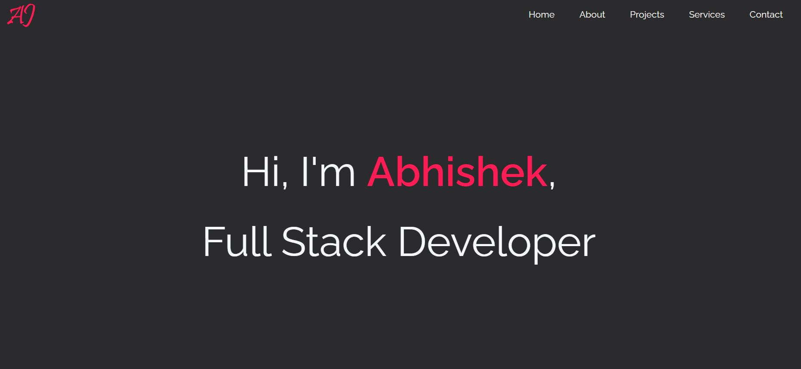

# Abhishek - Portfolio
## Version 1.0
## Description
>Portfolio page - Abhishek Jamwal

## Table of Contents
* [License](#license)
* [Link](#link)
* [Feature](#feature)
* [Credits](#credits)

## License

## Link

[Link to the portfolio page](http://jamwalab.me)

[YouTube Demo](https://youtu.be/6Tapagb7HNA)

## Feature
* Built using EJS.
* Responsive layouts.
* Resume available for download in pdf.
* Links email address, github profile and linkedin.

## Credits
#### React library and components
* [EJS](https://ejs.co/)

#### Users
* Abhishek Jamwal - [GitHub](https://github.com/jamwalab)